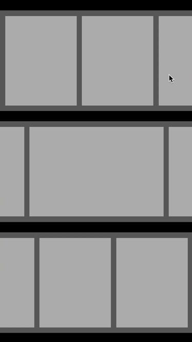

# Snap

[](http://cocoapods.org/pods/Snaply)
[](http://cocoapods.org/pods/Snaply)
[](http://cocoadocs.org/docsets/Snaply)
[](http://cocoapods.org/pods/Snaply)

## Usage

The example project includes an example of a UICollectionViewFlowLayout including support for sections and spacing. It also includes support for snapping to the left, middle and right edges.

<table>
<tr>
<th width="30%">Lets add snapping support to our UICollectionView</th>
<th width="30%">Snaply In Action</th>
</tr>
<tr>
<td>The following code is all that's required to setup the top preview on the right.</td>
<th rowspan="9"></th>
</tr>
<tr><td><div class="highlight highlight-source-swift"><pre>

let collectionView = UICollectionView(frame: view.bounds, 
collectionViewLayout: UICollectionViewFlowLayout())

// The delegate will automatically forward all events 
// to you existing delegate so it won't break your code :)
let snap = Snap(scrollView: collectionView, edge: .Min, 
direction: .Horizontal, delegate: self)

var locations = [CGFloat]()
var widths = [CGFloat]()

for i in 0..<20 {
  widths.append(itemWidth)
  let offset = layout.headerReferenceSize.width + 
  layout.sectionInset.left
  let size = widths.reduce(offset, 
  combine: { $0 + $1 + layout.minimumInteritemSpacing })
  locations.append(size - offset)
}

snap.setSnapLocations(locations, realignImmediately: true)

</pre></div></td></tr>
</table>

## How does it work

If we take a look at the following image, the red lines represent points we want our scrollView to snap to, along a given edge. So you just need to specify these points and Snaply will handle the snapping behaviour for you. Including things like finding the closest point and ensuring overscroll doens't occur.


To get started, you just need a single line in your project:

`snap = Snap(scrollView: collectionView, edge: .Min, direction: .Horizontal, delegate: self)`

This adds snapping to the specified collectionView, using the left edge as the snap point since we're using a horizontal layout. 

You may notice we also pass along the original delegate (if any). This allows Snaply to automatically forward all events back to the original delegate to ensure no existing behaviour is effected by dropping in Snaply :)

## Example

To run the example project, clone the repo, and run `pod install` from the Example directory first.

## Requirements

Snaply requires iOS 8+
The current version requires Swift 2.2

## Installation

Snap is available through [CocoaPods](http://cocoapods.org). To install
it, simply add the following line to your Podfile:

```ruby
pod "Snaply"
```

## Author

[@shaps](http://twitter.com/shaps) on Twitter

## License

Snap is available under the MIT license. See the LICENSE file for more info.
